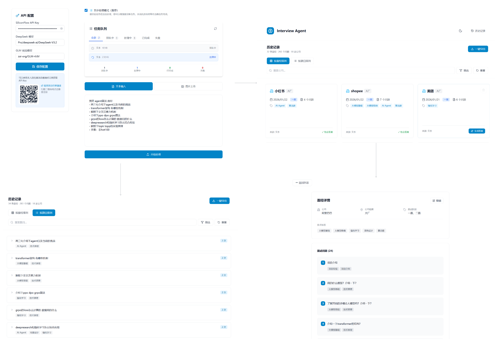
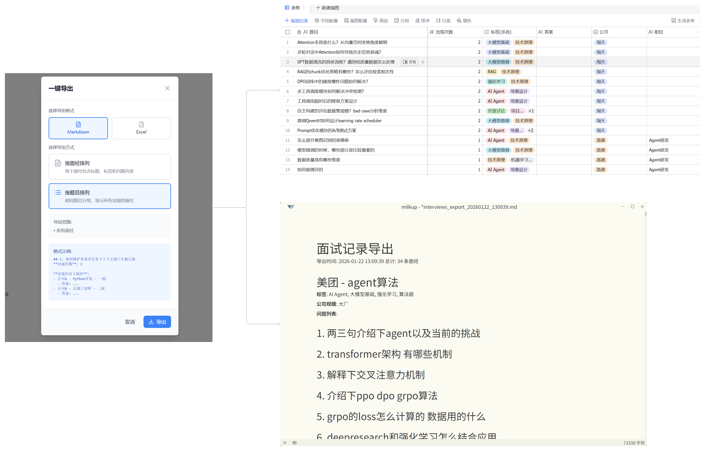

<div align="center">

# Interview Agent 面经整理助手

[](README_EN.md) | 简体中文

</div>

🎯 **AI 驱动的面试经验管理系统**

- 全程使用Claude code进行 vibe coding，练习产物
- 将非结构化的面试内容（文本或图片）转换为有组织、可搜索的知识库，支持智能标签、答案生成和多格式导出。
---

## ✨ 核心功能

- 📝 **多模态输入** - 支持文本和图片处理，配备 OCR 识别
- 🤖 **AI 智能处理** - 自动提取、标签化和答案生成
- 🔄 **异步处理** - 后台任务队列，处理大规模操作
- 📦 **批量处理** - 支持多文件处理，实时进度跟踪
- 🔍 **智能搜索** - 按公司、标签、日期等条件过滤
- 📤 **多格式导出** - JSON、Markdown、Excel 三种格式

## 🚀 快速开始

### 环境要求

- Python 3.10+
- uv
- Node.js 18+
- SiliconFlow API 密钥（[点击获取](https://cloud.siliconflow.cn/i/AlhX2oWk)）欢迎注册使用我的邀请码**AlhX2oWk**！

### 安装步骤

**1. 克隆项目**
```bash
git clone <repository-url>
cd interview_agent
```

**2. 安装Python后端依赖**
```bash
uv sync
```

**3. 安装前端依赖**
```bash
cd frontend
npm install
cd ..
```

**4. 配置环境变量**

复制环境变量模板：
```bash
cp .env.example .env
```

编辑 `.env` 文件，添加您的 API 密钥：
```env
SILICONFLOW_API_KEY=你的硅基流动API密钥
```

### 运行应用

#### 🎨 Web 界面（推荐）

**Windows 系统：**
```bash
start_dev.bat
```

**Linux/Mac 系统：**
```bash
chmod +x start_dev.sh
./start_dev.sh
```

启动后访问：
- 🔧 后端 API：http://localhost:8000
- 🎨 前端界面：http://localhost:5173
---

## 📖 使用指南




### Web 界面操作流程

1. **处理面试内容**
   - 访问 http://localhost:5173
   - 选择文本输入或拖拽上传图片
   - 可选启用 AI 答案生成
   - 提交并查看实时结果

2. **管理面试经验**
   - 访问 Gallery 页面查看所有保存的面经
   - 按公司、标签、日期筛选
   - 在线编辑或删除经验
   - 查看跨多次面试的问题分组

3. **导出数据**
   - 使用导出弹窗选择格式和筛选条件
   - 下载 JSON、Markdown 或 Excel 文件
   - 支持批量导出和自动编号

### 命令行操作流程

```bash
python src/main.py
```

按照交互式提示操作：
1. 粘贴文本或提供图片路径
2. 选择是否生成 AI 答案
3. 在终端查看处理结果

### API 调用示例

**处理文本内容：**
```bash
curl -X POST "http://localhost:8000/api/process/text" \
  -H "Content-Type: application/json" \
  -d '{"content": "您的面试文本内容", "generate_answers": false}'
```

**处理图片：**
```bash
curl -X POST "http://localhost:8000/api/process/image" \
  -F "file=@面试截图.png" \
  -F "generate_answers=false"
```

**查询面经：**
```bash
curl "http://localhost:8000/api/experiences?company=字节跳动&limit=10"
```

---

## 🏗️ 技术架构

### 核心技术栈

**后端：**
- Python 3.10+ / FastAPI（现代异步 Web 框架）
- SQLite（持久化存储）
- LangChain（LLM 编排）
- DeepSeek-V3.2（文本处理）
- GLM-4.6V（图片 OCR）

**前端：**
- React 18 + TypeScript
- Vite（快速构建工具）
- Tailwind CSS（样式框架）
- React Router（路由）

### 处理流程

```
输入（文本/图片）
    ↓
图片？→ OCR 识别（GLM-4.6V）→ 提取文本
    ↓
DeepSeek-V3.2 智能处理
    ├─ 提取结构化数据（公司、职位、问题）
    ├─ 清理和标准化内容
    ├─ 生成智能标签
    └─ 可选：生成缺失的答案
    ↓
保存到数据库
    ↓
导出选项（JSON / Markdown / Excel）
```

---

## 📂 项目结构

```
interview_agent/
├── src/                      # 后端源代码
│   ├── api/app.py           # FastAPI 应用（70+ 接口）
│   ├── agents/              # AI 智能体
│   ├── exporters/           # 导出服务
│   ├── handlers/            # 输入处理
│   ├── models/              # 数据模型
│   ├── utils/               # 工具函数
│   └── main.py              # 命令行入口
│
├── frontend/                 # React 前端
│   ├── src/
│   │   ├── pages/           # 页面组件
│   │   ├── components/      # UI 组件
│   │   ├── services/        # API 客户端
│   │   └── App.tsx          # 主应用
│   └── package.json
│
├── data/                     # SQLite 数据库
├── output/                   # 导出文件
├── .env.example             # 环境变量模板
├── pyproject.toml           # Python 依赖
├── start_dev.bat            # Windows 启动脚本
└── start_dev.sh             # Linux/Mac 启动脚本
```

---

## 🔌 API 文档

运行应用后访问交互式 API 文档：
**http://localhost:8000/docs**

包含 70+ 接口，涵盖：
- 处理接口（文本/图片/批量）
- 数据库 CRUD 操作
- 导出服务
- 答案生成
- 任务队列管理
- 配置管理

---

## 🛠️ 开发指南

### 后端开发
```bash
python -m uvicorn src.api.app:app --reload --port 8000
```

### 前端开发
```bash
cd frontend
npm run dev
```

### 全栈开发
同时启动前后端（使用 `start_dev.bat` 或 `start_dev.sh`）

---

## 📄 许可证

MIT License

## 📞 支持

- 🐛 [问题反馈](https://github.com/your-repo/issues)
- 💬 [讨论区](https://github.com/your-repo/discussions)